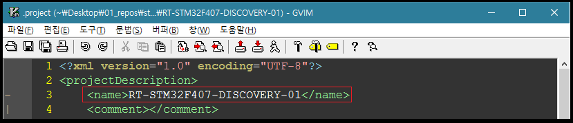
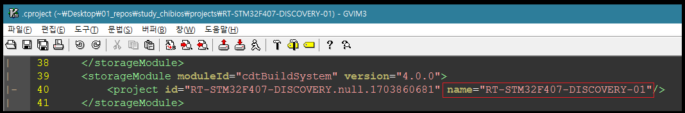
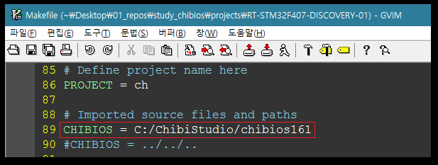

[서문으로 돌아가기](README.md#howwhat---어떻게-무엇을-개발하고-공유할까)
  
# study_chibios - starting a new project

### scratching from an existing project
  
포럼을 뒤져 보다가 충격적인(?) 사실을 알게 되었습니다. ChibiOS를 사용함에 있어서 "새 프로젝트 마법사" 같은 것은 없다는 것이죠. ChibiStudio를 쓰더라도 말입니다. 대신 Giovanni씨는 기존 프로젝트에서 스크래치를 통해 만드는 방법을 소개하고 있습니다. [관련글](http://www.chibios.com/forum/viewtopic.php?t=2655#p21120)
  
> In ChibiOS the support for STM32 is very complete, basically you just need to port the OS to a different board (your target). I recommend using one of the included demos for a while, you just nead a cheap Discovery or Nucleo board. This will allow you to test everything very quickly, you could download ChibiStudio for a very quick startup. I am describing the organization for ChibiOS 3.0, it is slightly different for previous versions, you are starting now so 3.0 should be your target. In order to create your project:  
>  
> **Step 1 - Creating new board files**  
> Under ./os/hal/boards there is a directory for each supported board. Copy one of the boards to a new directory, choose a board with the same device you need. You will have for example ./os/hal/boards/myboard.  
>  
> **Step 2 - Modifying board files**  
> Each directory contains always the same files:  
> myboard/cfg/board.chcfg <- It is an XML file  
> myboard/board.c  
> myboard/board.h  
> myboard/board.mk  
>  
> The CHCFG file is an XML description of your board: Initial GPIO settings, clock frequency, used device. Using a tool included in ChibiStudio you can generate the .h/.c/.mk files starting from CHCFG file. In ChibiStudio there is a guided XML editor, changing the CHCFG file is driven by a schema so it is not easy to do it wrong. Optionally you can edit board.h manually, it is not difficult but not the preferred way.  
>  
> **Step 3 - Create your application**  
> Clone one of the demos using the same device into another directory: ./demos/myproj. You can use any path but lets start simple.  
> Open .project and .cproject in an editor and search/replace the project name with your name. Import the new project in your Eclipse workspace (if using Eclipse/ChibiStudio).  
>  
> **Step 4 - Modify the Makefile**  
> There is a path to the board.mk file, change it to point to your board.mk.  
>  
> **Step 5 - Cleanup main() function and write yur code**  
> It is done, you remove the code not needed (blinker thread, test code execution) the you have an empty project.  
  
우리의 경우에는, ChibiOS가 STM32F407-Discovery를 완벽 지원하기 때문에, 1~2 단계를 따를 필요가 없습니다. 3단계 부터 살펴 보자면:  

- 먼저 적당한 데모 프로젝트(RT-STM32F407-DISCOVERY)를 원하는 곳에 복사해 줍니다. 
- 폴더 이름을 적절히 바꿔줍니다. (ex: RT-STM32F407-DISCOVERY-01)
- 다음으로는 복사된 프로젝트 안에서 **.project** 파일을 찾아 프로젝트 이름을 바꿔 줍니다. 정확히는 ChibiOS 16.1 버전 기준으로 3번째 줄의 **name** 태그의 내용을 폴더와 동일하게 바꿔 줍니다.  
- 그 다음으로는 복사된 프로젝트 안에서 **.cproject** 파일을 찾아 프로젝트 이름을 바꿔 줍니다. 정확히는 ChibiOS 16.1 버전 기준으로 40번째 줄의 **name** 태그의 내용을 폴더와 동일하게 바꿔 줍니다.  
- 세번째로 **Makefile**을 열어 CHIBIOS 변수의 내용을 "../../.."에서 "C:/ChibiStudio/chibios161"로 변경해 줍니다. ChibiOS 16.1 버전 기준으로 89번째 줄에서 변경할 수 있습니다.  
- 마지막으로 **main.c**의 내용을 적절히 변경해 줍니다. (이 부분은 다음 챕터에서 소개하도록 하겠습니다.)
  
이상의 내용을 수행하고 저장된 프로젝트가 본 저장소의 projects 폴더 안에 담겨 있습니다. (RT-STM32F407-DISCOVERY-01)  

.project, .cproject, Makefile의 변경 내용은 다음 스크린샷에서 확인할 수 있습니다. 

  
  
  
  
  
  
이렇게 편집 된 프로젝트는 ChibiStudio (이클립스)에서 import 하고 컴파일 함으로써 설정이 제대로 된 것을 확인할 수 있습니다.
  

[서문으로 돌아가기](README.md#howwhat---어떻게-무엇을-개발하고-공유할까)
