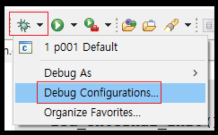
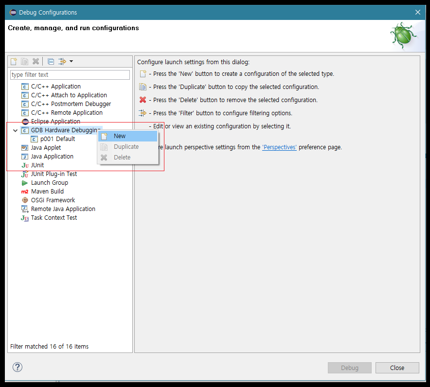
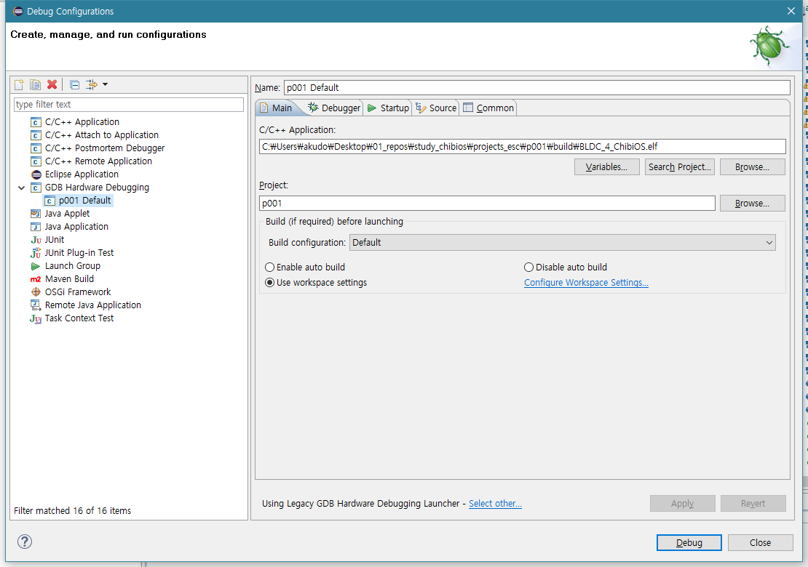
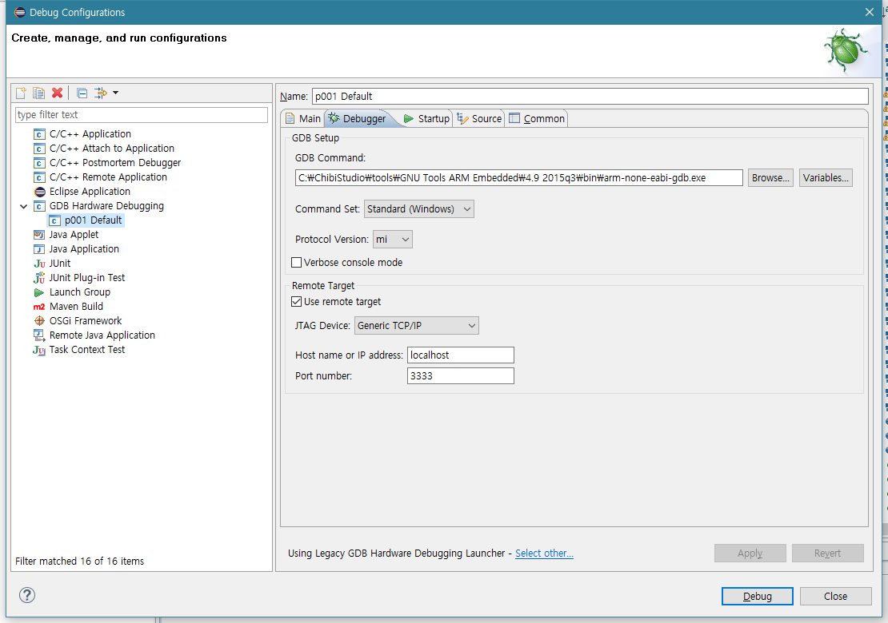
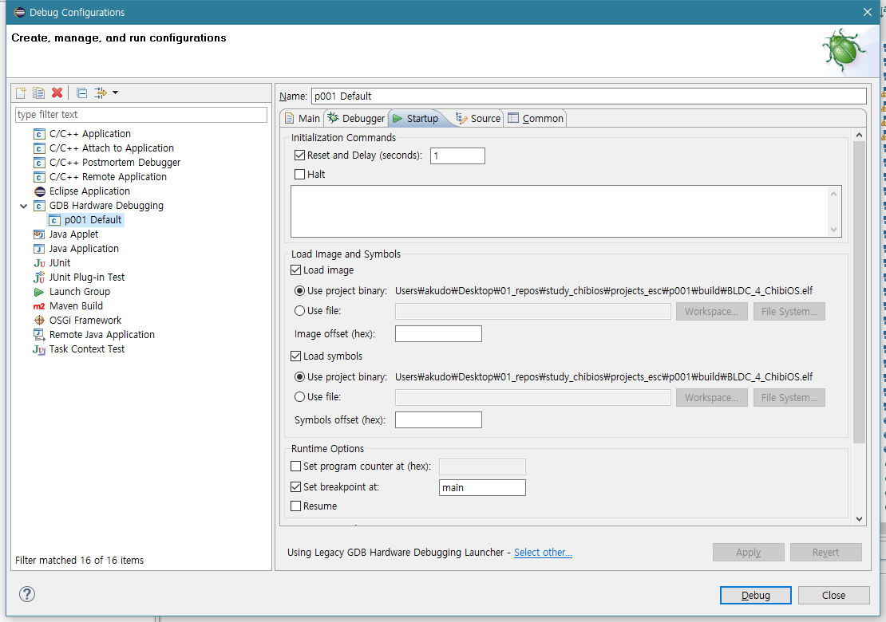
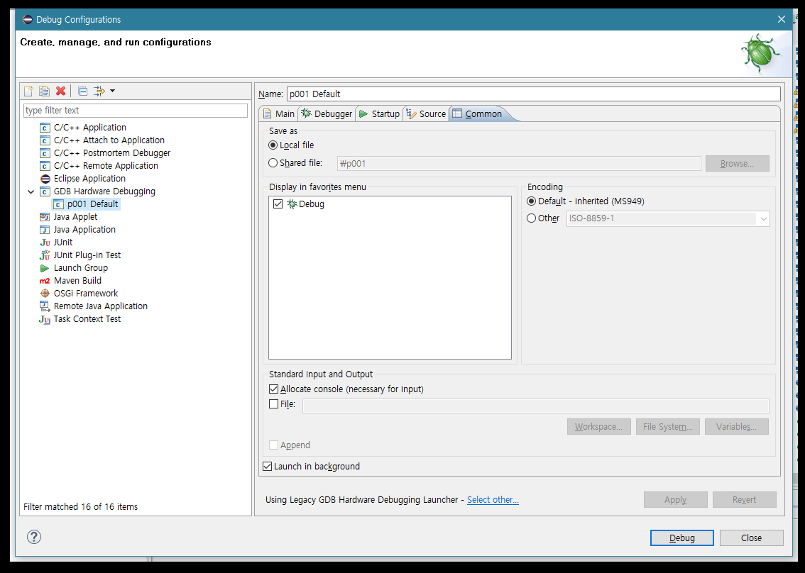

[서문으로 돌아가기](README.md#howwhat---어떻게-무엇을-개발하고-공유할까)
  
# study_chibios - debugging with eclipse
  
### debugging with eclipse  
  
지난 글에서는 ChibiOS 프로젝트를 새로 생성하는 방법을 알아보았습니다. 코드를 수정하지 않았다면 컴파일도 문제가 없었을 것 입니다. 앞으로 소스 코드를 살펴 보며 조금씩 ChibiOS의 실제 사용법을 알아봐야 하겠지만, 그에 앞서 디버거를 이용하는 방법을 아는 것이 우선이라 생각되어, 본 글에서는 그와 관련 된 내용을 알아보도록 하겠습니다. 이번의 내용은 ChibiOS 공식 사이트에 게시된 글([>>>](http://www.chibios.org/dokuwiki/doku.php?id=chibios:guides:eclipse2))에서 많은 부분을 참고 하였음을 미리 밝힙니다.  
  
### GDB용 디버거 설정하기  
  
프로젝트가 열려있는 이클립스의 툴바를 살펴보면, 벌레처럼 생긴 심볼이 보입니다. **그 우측**의 역삼각형(?) 화살표(?) 아이콘을 누르면 아래 이미지와 같은 드롭다운 메뉴가 보입니다. 
  
  
  
그 안의 메뉴 중에서 **"Debug Configuration"**을 클릭하면, 아래와 같은 다이얼로그가 생성 됩니다.  
이미지와 같이 좌측 메뉴 중, **"GDB Hardware Debugging"**을 우클릭하면, 컨텍스트 메뉴가 생성 되고, 그 중에서 **"New"**을 클릭하도록 합니다. 

  

그렇게 생성된 새로운 디버깅 프로필을 설정 해주기 위해서는 각 탭들 (Main, Debugger, Startup, Source, Common) 내의 메뉴를 적절히 설정해 주어야 합니다.  
  
먼저, Main 탭 입니다. elf 파일의 위치와 프로젝트의 이름 등을 설정해 줍니다.

  

Debugger 탭에서는 GDB 유틸리티의 바이너리가 있는 곳을 지정해 주어야 합니다. 우리의 경우엔 "C:/ChibiOS/tools/GNU Tools ARM Embedded/4.9 2015q3/bin/arm-none-eabi-gdb.exe"를 선택해 줍니다. "Remote Target" 아래에서는 포트 번호를 "3333"으로 해주도록 합니다.  
  
  

Startup 탭에서는 elf 파일과 심볼의 위치가 (Main 탭에서 elf 파일의 위치를 설정하면서 자동으로) 입력 되어집니다. 
  
   
  
(Source 탭은 건너뛰고) Common 탭은 다음과 같이 설정이 되어 있을 것 입니다.  
    
   
  

