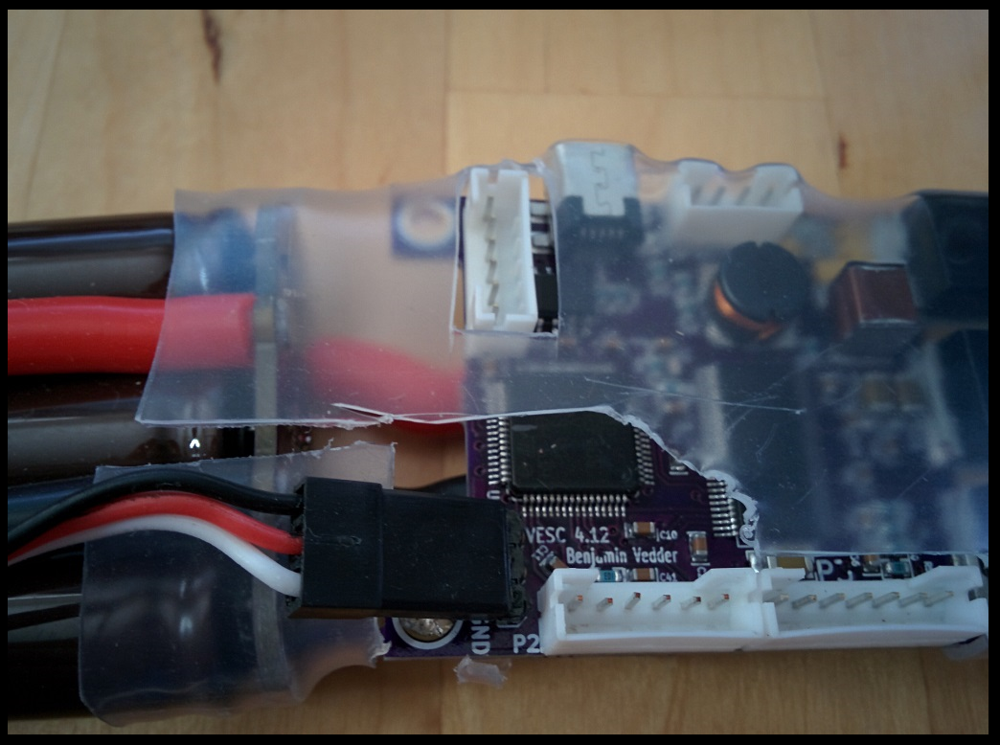
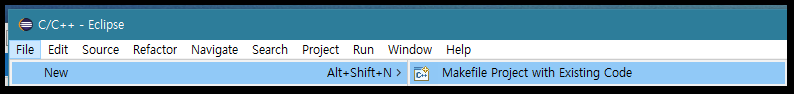
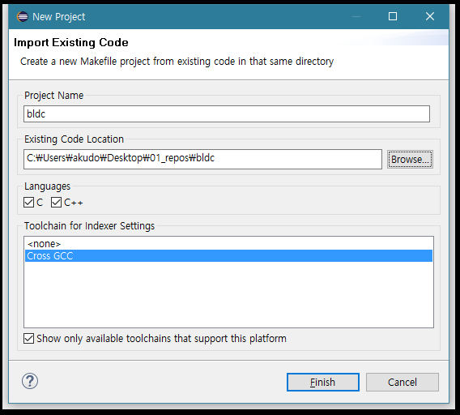

[서문으로 돌아가기](README.md#howwhat---어떻게-무엇을-개발하고-공유할까)

# study_chibios - understanding Vedderb-OpenESC  
   
### background
  
서문에서 적은 바와 같이 저희 팀이 지향하는 것은 ChibiOS를 이용하여 BLDC 모터를 제어하는 것 입니다. 이 프로젝트 자체가 Vedder Bejamin의 OpenESC 프로젝트에 영향을 많이 받았으므로 OpenESC를 분석함으로써 우리가 필요로 하는 기능을 구현하는 것은 자연스러운 일이라 할 것 입니다.   

OpenESC에 대한 자세한 내용은 Vedder의 블로그인 [vedder.se](http://vedder.se/2015/01/vesc-open-source-esc/)에 소개 되어 있습니다. 간단히 요약하자면 아래와 같이 구성 되어 있습니다.
  
- ChibiOS 3.0.2 기반 (2016년 10월 현재)
- STM32F40x를 콘트롤러로 사용
- MOSFET으로 출력 되는 3 phase 신호로 BLDC 모터를 제어 (톱니파, 삼각파, FOC 제어 가능)
- BLDC 모터에서 제공하는 hall sensor와 온도 센서를 통해 closed-loop 제어 가능
- MOSFET의 제어를 위해 TI의 DRV8302 IC를 사용하며, 해당 칩은 주 전원 입력 (20~60Vdc)을 강하하여 디지털 회로가 필요로 하는 전원 (5Vdc)을 제공함 (실제로 MCU에 공급 되는 전원은 TC2117을 통해 3.3V로 다시 강하됨)
- 다양한 통신 기능이 제공 됨 (UART, CAN, Nrf, USB..)
- 리눅스 상의 응용 프로그램이 제공 됨
  
회로도, PCB 아트웍, 펌웨어 등을 비롯한 모든 정보가 github에 공개 되어 있으므로([>>>](https://github.com/vedderb)), 평가 보드를 입수하지 못 하더라도 충분히 좋은 교재가 될 수 있으리라고 생각 합니다.  
  
  
  
### downloading F/W
  
저희가 현재 교재로 삼고 있는 커밋 버전은 **"1655c11"**이며 제 계정에 fork 해 놓은 상태 입니다 ([>>>](https://github.com/bus710/bldc)). 따라서 해당 저장소를 클론하여 폴더를 열어보면 약 70개에 가까운 파일들(폴더, 헤더, c코드, makefile...)이 있음을 알 수 있습니다. 일단은 이클립스에서 해당 프로젝트를 열어 컴파일을 해보도록 하겠습니다. 
  
이를 위해서는 이클립스에서 **"File >> New >> Makefile Project with Existing Code"**를 실행합니다. 
  
  
  
이후 표시 되는 다이얼로그에서 **Browse**를 클릭하고, 해당 프로젝트를 열어 줍니다. 
  
  

다음으로는 여타 ChibiOS 프로젝트와 마찬가지로 컴파일(Project >> Build All (^B))을 수행 해주면, 정상적으로 컴파일 된 것을 확인할 수 있을 것 입니다.  
  
### anatomy OpenESC  
  
컴파일이 가능한 OpenESC 프로젝트를 입수하였으니, 이제 프로젝트의 구조를 파악 해야할 것 입니다.
  
아래의 리스트는 ChibiOS의 기본 파일과 OpenESC가 중복 되는 파일들 입니다. 
  
- .cproject
- .project
- chconf.h
- halconf.h
- main.c
- Makefile
- mcuconf.h
- readme.txt

아래의 리스트는 OpenESC에만 속한, 프로젝트를 위해 추가 된 파일들 입니다. 

- appconf (폴더)
- application (폴더)
- ChibiOS_3.0.2 (폴더) 
- docs (폴더)
- hwconf (폴더)
- mcconf (폴더)
- nrf (폴더)
- .cproject
- .project
- buffer.c/h
- chconf.h
- comm_can.c/h
- comm_usb.c/h
- comm_usb_serial.c/h
- commands.c/h
- conf_general.c/h
- crc.c/h
- datatypes.h
- digital_filter.c/h
- eeprom.c/h
- encoder.c/h
- flash_helper.c/h
- halconf.h
- irq_hadlers.c
- isr_vector_table.h
- ld_eeprom_emu.ld
- led_external.c/h
- ledpwm.c/h
- main.c
- Makefile
- mc_interface.c/h
- mcpwm.c/h
- mcpwm_foc.c/h
- mcuconf.h
- packet.c/h
- servo.c/h
- servo_dec.c/h
- servo_simple.c/h
- stm32-bv_openocd.cfg
- stm32f4xx_conf.h
- terminal.c/h
- timeout.c/h
- utils.c/h
- ws2811.c/h
