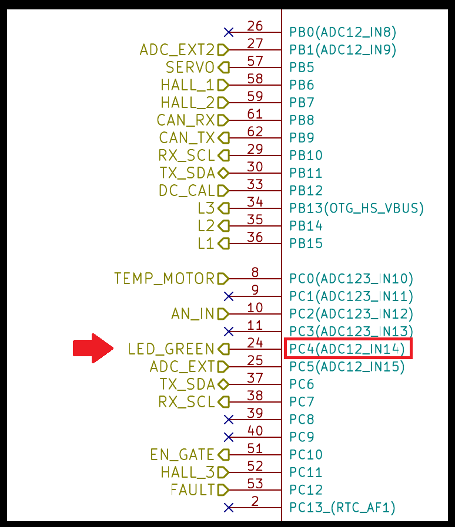

[서문으로 돌아가기](README.md#howwhat---어떻게-무엇을-개발하고-공유할까)

# study_chibios - LED control

### background

소스 코드들이 어떤 역할을 하는지 간략하게 나마 살펴 보았으니 이제 실제로 조금씩 원하는대로 바꿔볼 차례 입니다. 첫번째로는 역시 GPIO로 1과 0을 출력하는 것이 적절하리라고 생각 합니다. OpenESC가 제공하는 코드를 수정하여 해당 보드에 있는 LED를 on/off 함으로써 여타 장비 없이 육안으로 코드의 동작을 확인해 보도록 하겠습니다.   
  
LED를 제어하기 위해서는 먼저 어느 출력 핀에 LED가 연결 되어 있는지 확인해 봐야할 것 입니다. 
  
  
  
위 그림과 같이 녹색 LED가 PC4에 연결 되어 있는 것을 알 수 있습니다.  
  
### code review
  
하드웨어는 얼추 확인 되었으니 코드를 볼 차례 입니다. 원래대로라면 mcuconf.h 등의 파일들도 참고사항이 될 수 있겠습니다만, 일단은 main.c로 바로 들어가 보겠습니다.  

```C

```
