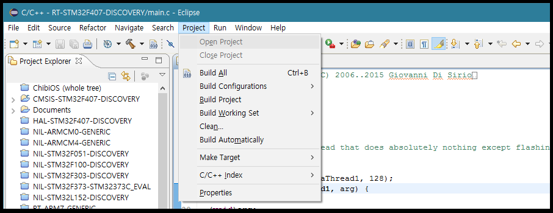
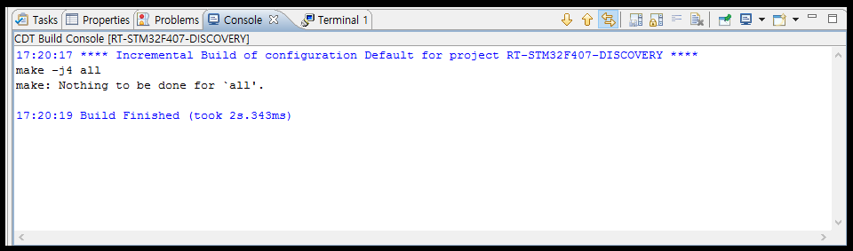

[서문으로 돌아가기](../README.md#어떻게-무엇을-개발하고-공유할까)
  
# study_chibios - 다운로드와 설치
  
### 치비OS와 치비 스튜디오  
  
ChibiOS의 개발자인 Giovanni씨는 웹사이트와 SNS를 통해 그와 그의 팀이 개발한 제품들에 대한 다양한 정보를 제공하고 있습니다.  
    
- [공식 웹사이트](http://www.chibios.org/)
- [트위터](https://twitter.com/ChibiOS_RT)
- [페이스북](https://www.facebook.com/chibios/)
- [링크드인](https://www.linkedin.com/company/chibios-rt)
- [포럼](http://www.chibios.com/forum/)
- [블로그](http://www.playembedded.org/blog/en/2014/10/11/how-to-setup-chibistudio/)
  
또한, 실제 소프트웨어들은 소스포지에서 다운로드 가능 합니다.  
- [소스포지](https://sourceforge.net/projects/chibios/)  
  
ChibiOS는 윈도우즈에서 개발하는 것이 추천 되고 있으며, 개발을 위한 모든 소스코드, IDE, 유틸리티를 한번에 제공하는 ChibiStudio를 권장 합니다.
  
저 위의 소스포지에서 ChibiStudio 17 preview를 적당한 위치에 다운로드 바랍니다. 

### 기타 소프트웨어들  
  
CbiboStudio를 다운 받은 후에도 다음과 같은 유틸리티들이 필요 합니다.

- [7zip](http://www.7-zip.org/): ChibiStudio가 7z으로 압축 되어 있으므로 해제하기 위해 사용 됩니다.
- [stlink v2 드라이버](http://www.st.com/content/st_com/en/products/development-tools/hardware-development-tools/development-tool-hardware-for-mcus/debug-hardware-for-mcus/debug-hardware-for-stm32-mcus/st-link-v2.html): 타겟인 Discovery 보드에 내장 된 stlink v2를 활용하기 위해서는 드라이버가 필요 합니다. ChibiStudio에 포함된 OpenOCD와 함께 사용 됩니다.
- [Java SE Runtime Env., 32bit](http://www.oracle.com/technetwork/java/javase/downloads/jre8-downloads-2133155.html): IDE인 이클립스가 동작하기 위해서는 JRE가 필요 합니다. 단, 32비트 버전으로 설치 바랍니다.
- [Github Desktop](https://desktop.github.com/) 본 안내서를 포함하여 다양한 저장소에서 소스코드들을 다운로드하기 위한 도구 입니다. 
- [Vrapper](http://vrapper.sourceforge.net/home/) 개인적으로 vi navigation 스타일을 선호 합니다. 
- [Eclipse Color Theme](https://marketplace.eclipse.org/content/eclipse-color-theme) 이클립스의 컬러 패키지 입니다. 개인적으로는 Windows Classic을 전체 색상으로 하고, minimal을 에디터의 색상으로 하는 것이 제일 좋았습니다.  
- [Naver D2coding font](http://dev.naver.com/projects/d2coding) 네이버의 코딩용 폰트 입니다. 

### 설치 과정과 기본 사용방법
  
7zip으로 압축을 해제하고 해당 폴더를 확인하면 ChibiStudio 폴더가 있는 것을 알 수 있습니다. 그 폴더를 시스템 루트 디렉토리에 (대부분은 c:\ 드라이브 겠죠.) 붙여넣기 합니다. 그 후 그 폴더에 있는 바로가기 파일(Chibi Studio GCC 4.9)을 적당한 곳에 복사 합니다. JRE가 잘 설치 되었다는 가정하에, 바로가기 파일을 더블클릭하면 이클립스가 실행 됩니다.   
  

  
일반적인 경우에는 path 등의 설정을 할 필요가 일절 없습니다. 이 상태에서 이클립스, ARM-GCC, OpenOCD를 통해 소스코드 편집, 컴파일, 다운로드까지 모든 것을 수행할 수 있습니다. 일단은 RT로 시작하는 프로젝트 중 하나를 열고, 컴파일만 수행해 보도록 하겠습니다.   
(추가: 응용편에서 vedder의 프로젝트를 이용하는 경우에는 make의 바이너리 경로를 path 변수에 추가해 주어야 할 수도 있습니다. 해당 위치는 **"C:\ChibiStudio\tools\gnutools\bin"** 입니다.)  
  
  
   
제 경우에는, 아무런 이상 없이 컴파일이 되고, 아래와 같이 컴파일러의 메시지를 확인할 수 있었습니다.  
  
  

다음으로는 ChibiOS를 활용하기 위하여 프로젝트를 생성하고, 코드를 살펴보도록 하겠습니다. 
  
  
[서문으로 돌아가기](../README.md#어떻게-무엇을-개발하고-공유할까)
