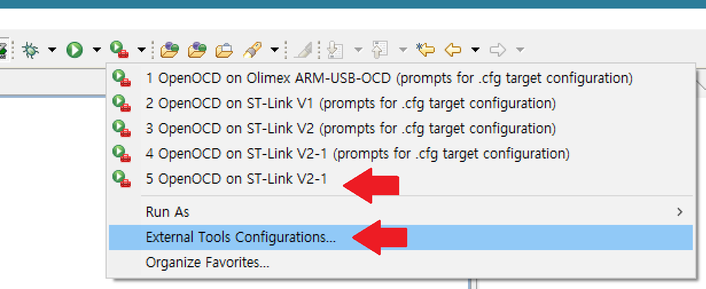
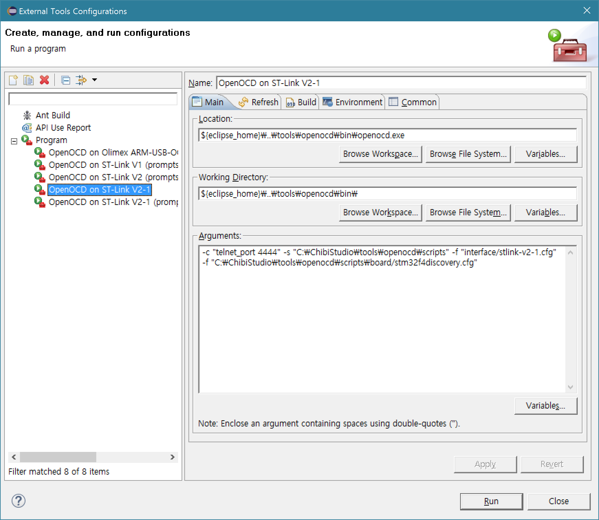
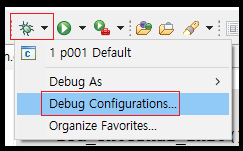
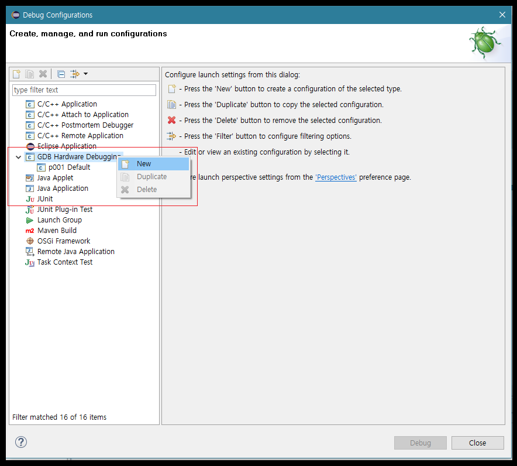
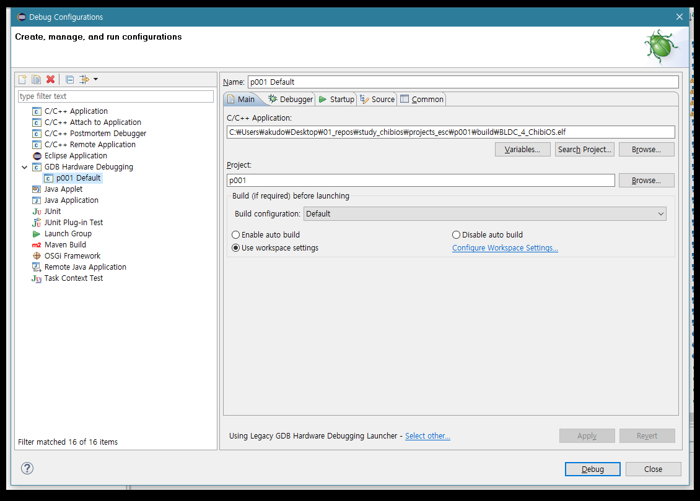
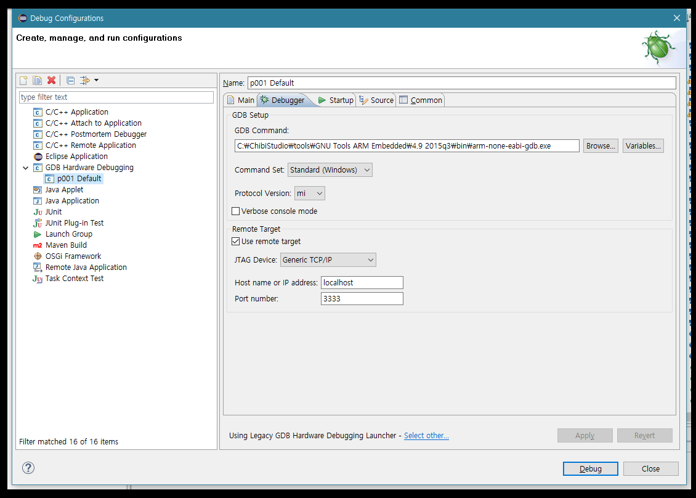
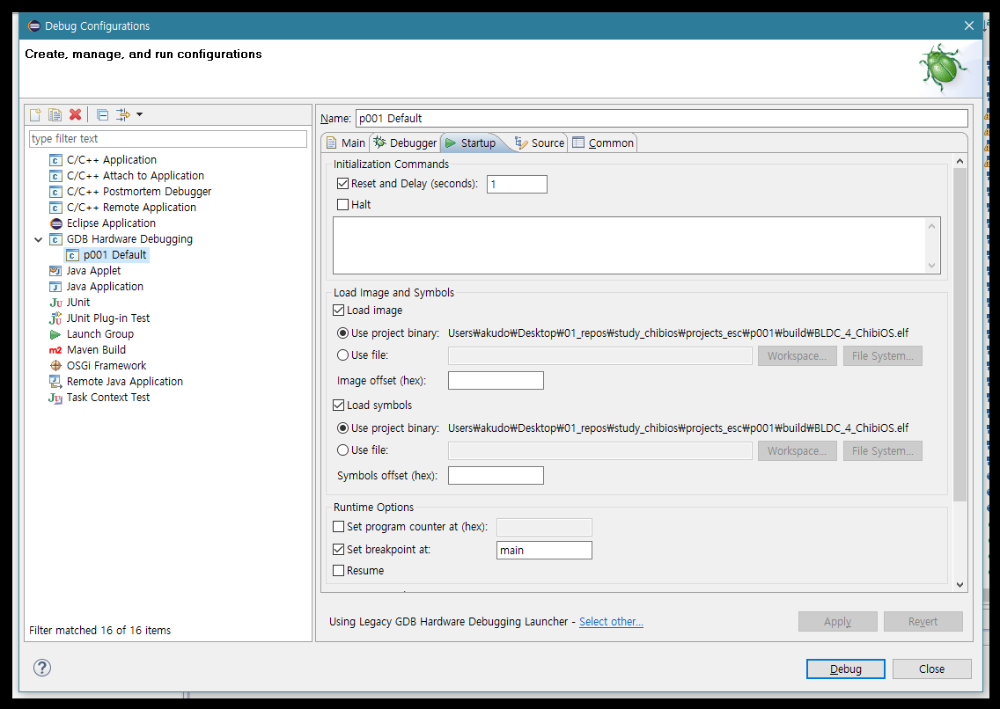
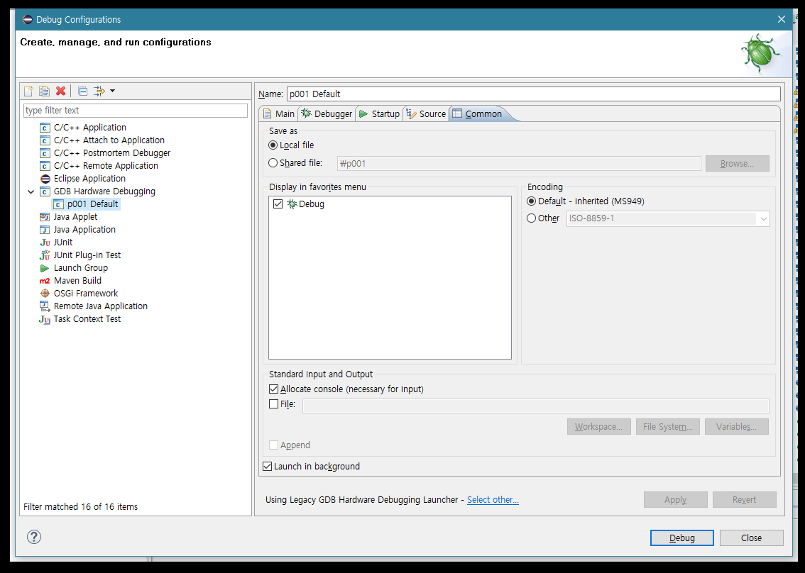
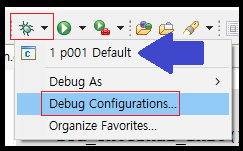
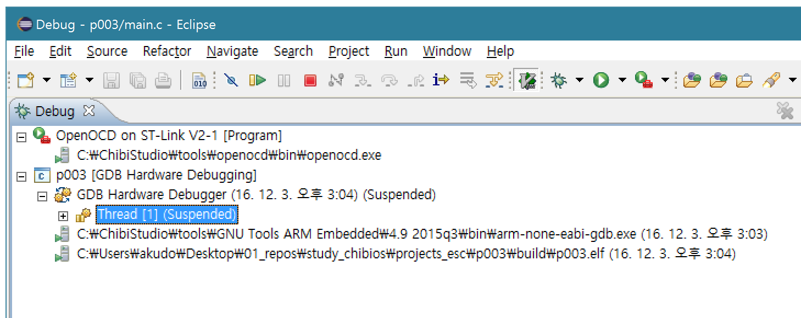

[서문으로 돌아가기](../README.md#어떻게-무엇을-개발하고-공유할까)
  
# study_chibios - 이클립스에서 디버깅하기
  
### 이클립스에서 디버깅하기   
  
지난 글에서는 ChibiOS 프로젝트를 새로 생성하는 방법을 알아보았습니다. 코드를 수정하지 않았다면 컴파일도 문제가 없었을 것 입니다. 앞으로 소스 코드를 살펴 보며 조금씩 ChibiOS의 실제 사용법을 알아봐야 하겠지만, 그에 앞서 디버거를 이용하는 방법을 아는 것이 우선이라 생각되어, 본 글에서는 그와 관련 된 내용을 알아보도록 하겠습니다. 이번의 내용은 ChibiOS 공식 사이트에 게시된 글([>>>](http://www.chibios.org/dokuwiki/doku.php?id=chibios:guides:eclipse2))에서 많은 부분을 참고 하였음을 미리 밝힙니다.  

ChibiOS의 디버깅에는 두가지 중요한 소프트웨어들이 사용 됩니다. 
1. OpenOCD는 ST link 드라이버를 관리하는 일종의 서버로써 동작하며 디버깅용 소프트웨어가 요청하는 것에 맞춰 MCU의 프로그램 카운터와 브레이크 포인트를 제어함으로써 디버깅이 가능하게 합니다.
2. GDB는 GCC의 디버거 입니다. 디버깅하고자 하는 소프트웨어가 현재 개발용 시스템과 동일한 경우, 즉, PC에서 PC용 소프트웨어를 개발할 때는 GDB와 부속 소프트웨어만으로 디버깅이 가능하지만 우리의 경우엔 개발용 시스템과 타겟 시스템이 다르기 때문에 GDB가 직접 디버깅용 하드웨어 (ST link)와 타겟 하드웨어 (STM32Fx-Discovery)를 제어할 수 없습니다. 따라서, 일종의 클라이언트가 되어 OpenOCD에 접속하여 디버깅을 진행 합니다.  

### OpenOCD 설정하기 
  
프로젝트가 열려있는 이클립스의 툴바를 살펴보면, 녹색 동그라미와 흰색 화살표가 그려져 있고 그 옆에 공구통 같은 것이 그려진 아이콘이 있습니다. 그 옆의 검은 화살표를 누르면 아래와 같은 드롭다운 메뉴가 나타납니다.   
  
   
  
윗쪽의 메뉴는 우리가 OpenOCD를 실행할 때 눌러야 할 버튼이고 아랫쪽의 메뉴는 OpenOCD를 우리가 원하는 대로 설정하기 위한 버튼 **"External Tool Configuration"** 입니다. 일단 아랫쪽의 버튼을 누르면 설정 창이 나타날 것 입니다.  
  
   
  
좌측 리스트의 Program을 우클릭하여 새 항목을 만들고 그 내용은 우측에 적힌대로 입력해 줍니다. 즉, Location에는 OpenOCD의 바이너리 위치를 적어주고, Arguments에는 stm32f4-discovery.cfg 파일의 위치를 적어주도록 합니다.   
  
여기까지가 OpenOCD의 설정이었습니다. 간단하죠?^^  
  
### GDB용 디버거 설정하기  
  
프로젝트가 열려있는 이클립스의 툴바를 살펴보면, 벌레처럼 생긴 심볼이 보입니다. **그 우측**의 검은색 화살표 아이콘을 누르면 아래 이미지와 같은 드롭다운 메뉴가 보입니다. 
  
  
  
그 안의 메뉴 중에서 **"Debug Configuration"**을 클릭하면, 아래와 같은 다이얼로그가 생성 됩니다.  
이미지와 같이 좌측 메뉴 중, **"GDB Hardware Debugging"**을 우클릭하면, 컨텍스트 메뉴가 생성 되고, 그 중에서 **"New"**을 클릭하도록 합니다. 

  

그렇게 생성된 새로운 디버깅 프로필을 설정 해주기 위해서는 각 탭들 (Main, Debugger, Startup, Source, Common) 내의 메뉴를 적절히 설정해 주어야 합니다.  
  
먼저, Main 탭 입니다. elf 파일의 위치와 프로젝트의 이름 등을 설정해 줍니다.

  

Debugger 탭에서는 GDB 유틸리티의 바이너리가 있는 곳을 지정해 주어야 합니다. 우리의 경우엔 "C:/ChibiOS/tools/GNU Tools ARM Embedded/4.9 2015q3/bin/arm-none-eabi-gdb.exe"를 선택해 줍니다. "Remote Target" 아래에서는 포트 번호를 "3333"으로 해주도록 합니다.  
  
  

Startup 탭에서는 elf 파일과 심볼의 위치가 (Main 탭에서 elf 파일의 위치를 설정하면서 자동으로) 입력 되어집니다. 
  
   
  
(Source 탭은 건너뛰고) Common 탭은 다음과 같이 설정이 되어 있을 것 입니다.  
    
   
  
### 디버깅 시작하기  

이제 OpenOCD와 GDB의 설정이 완료 되었습니다. 이제 저 두 도구를 실행하여 디버깅 모드를 실행 시켜 보도록 합니다. (물론 ST link, 타겟 보드, PC들이 적절히 연결 되어 있고, 타겟 보드에는 전원이 공급되고 있어야 합니다.)  
   
이제는 Configuration 버튼들 대신에 각각 생성된 메뉴들을 눌러 주어야 합니다. 대신 OpenOCD를 먼저 실행하고, 그 후에 GDB를 실행해야 합니다. OpenOCD의 경우엔 5번인 "OpenOCD on ST link"를 클릭하고, GDB의 경우엔 "p001 default"를 클릭해야 합니다 (p001.elf는 안 됩니다~).
  
  
  

모든 것이 정상이라면, 이클립스의 디버깅 퍼스펙티브가 실행되어 엔지니어가 자유자재로 MCU를 관찰할 수 있게 해줄 것 입니다. 

### 디버깅 마치기

작업이 끝난 후에는 물론 디버깅 모드에서 빠져 나와야 하는데,  
1. 해당 프로젝트를 디버그 윈도우에서 선택하고 빨간 버튼을 눌러 GDB를 종료 합니다.  
2. OpenOCD를 디버그 윈도우에서 선택하고 빨간 버튼을 눌러 OpenOCD를 종료 합니다.  

  

리스트의 모든 항목이 **"terminated"** 되면 디버깅과 관련된 프로세스가 모두 종료 된 것 입니다.
  
### 마치며
  
자, 이제 디버깅도 가능하게 되었습니다. 여타 프로그래밍 프로젝트와 마찬가지로 브레이크 포인트 등을 설정하고 변수 등을 관찰함으로써 버그를 찾는 것이 한층 쉬워질 것 입니다. 이제 이 다음으로는 실제 코드를 조금씩 살펴 보도록 하겠습니다.  
  
[서문으로 돌아가기](../README.md#어떻게-무엇을-개발하고-공유할까)
