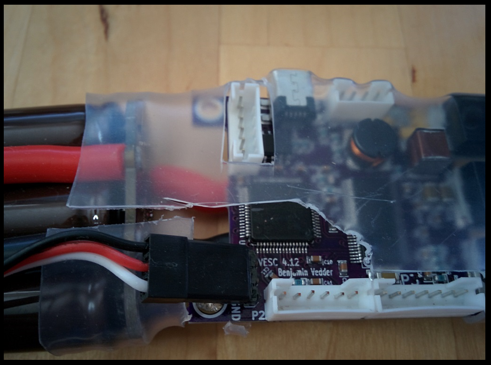
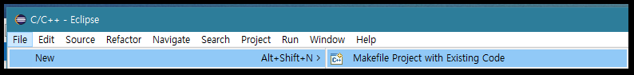
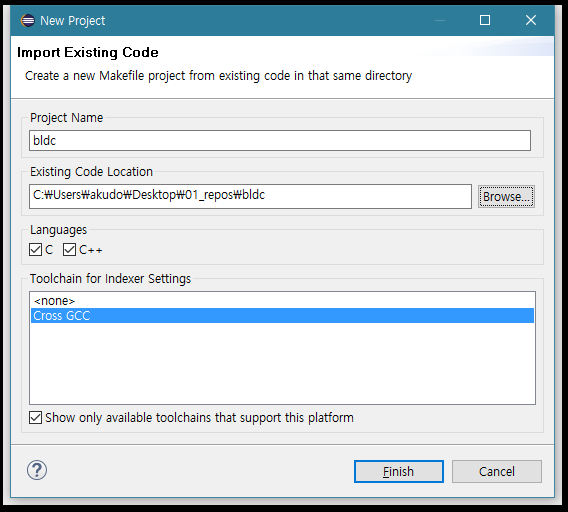

[서문으로 돌아가기](../README.md#howwhat---어떻게-무엇을-개발하고-공유할까)

# study_chibios - understanding Vedderb-OpenESC  
   
### background
  
서문에서 적은 바와 같이 저희 팀이 지향하는 것은 ChibiOS를 이용하여 BLDC 모터를 제어하는 것 입니다. 이 프로젝트 자체가 Vedder Bejamin의 OpenESC 프로젝트에 영향을 많이 받았으므로 OpenESC를 분석함으로써 우리가 필요로 하는 기능을 구현하는 것은 자연스러운 일이라 할 것 입니다.   

OpenESC에 대한 자세한 내용은 Vedder의 블로그인 [vedder.se](http://vedder.se/2015/01/vesc-open-source-esc/)에 소개 되어 있습니다. 간단히 요약하자면 아래와 같이 구성 되어 있습니다.
  
- ChibiOS 3.0.2 기반 (2016년 10월 현재)
- STM32F40x를 콘트롤러로 사용
- MOSFET으로 출력 되는 3 phase 신호로 BLDC 모터를 제어 (톱니파, 삼각파, FOC 제어 가능)
- BLDC 모터에서 제공하는 hall sensor와 온도 센서를 통해 closed-loop 제어 가능
- MOSFET의 제어를 위해 TI의 DRV8302 IC를 사용하며, 해당 칩은 주 전원 입력 (20~60Vdc)을 강하하여 디지털 회로가 필요로 하는 전원 (5Vdc)을 제공함 (실제로 MCU에 공급 되는 전원은 TC2117을 통해 3.3V로 다시 강하됨)
- 다양한 통신 기능이 제공 됨 (UART, CAN, Nrf, USB..)
- 리눅스 상의 응용 프로그램이 제공 됨
  
회로도, PCB 아트웍, 펌웨어 등을 비롯한 모든 정보가 github에 공개 되어 있으므로([>>>](https://github.com/vedderb)), 평가 보드를 입수하지 못 하더라도 충분히 좋은 교재가 될 수 있으리라고 생각 합니다.  
  
  
  
### downloading F/W
  
저희가 현재 교재로 삼고 있는 커밋 버전은 **"1655c11"**이며 제 계정에 fork 해 놓은 상태 입니다 ([>>>](https://github.com/bus710/bldc)). 따라서 해당 저장소를 클론하여 폴더를 열어보면 약 70개에 가까운 파일들(폴더, 헤더, c코드, makefile...)이 있음을 알 수 있습니다. 일단은 이클립스에서 해당 프로젝트를 열어 컴파일을 해보도록 하겠습니다. 
  
이를 위해서는 이클립스에서 **"File >> New >> Makefile Project with Existing Code"**를 실행합니다. 
  
  
  
이후 표시 되는 다이얼로그에서 **Browse**를 클릭하고, 해당 프로젝트를 열어 줍니다. 
  
  

다음으로는 여타 ChibiOS 프로젝트와 마찬가지로 컴파일(Project >> Build All (^B))을 수행 해주면, 정상적으로 컴파일 된 것을 확인할 수 있을 것 입니다.  
  
### anatomy OpenESC  
  
컴파일이 가능한 OpenESC 프로젝트를 입수하였으니, 이제 프로젝트의 구조를 파악 해야할 것 입니다.
  
먼저, 아래의 리스트는 ChibiOS의 어플리케이션을 위한 기본적인 파일들 입니다. 

| 번호 	| 파일명 (알파벳 순) 	| 설명 | 
| :----	| :---- 				| :---- |
| 1		| .cproject				| 이클립스와 툴체인의 관계를 설정하기 위한 파일이며, 컴파일러와 링커 옵션의 설정이 가능	|
| 2		| .project				| 오브젝트를 링킹할 때 참고 되는 파일 | 
| 3		| chconf.h				| ChibiOS 커널의 전역적 옵션 설정을 하기 위한 파일 | 
| 4		| halconf.h				| 하드웨어 레이어의 전역적 옵션 설정을 하기 위한 파일 |
| 5		| main.c				| 어플리케이션 진입점 |
| 6		| Makefile				| 컴파일 과정을 기술하기 위한 파일 |
| 7		| mcuconf.h				| ChibiOS가 이용하는 MCU의 기능들의 활성화와 우선권 설정을 하기 위한 파일 	|
| 8		| readme.txt			| 프로젝트 안내용 파일	|

아래의 리스트는 OpenESC에 속한 모든 파일들 입니다. 즉, 위의 파일들을 기본으로 삼아 OpenESC를 위해 작성 된 파일들인 것 입니다.  

| 번호	| 파일명 (알파벳 순)	| 설명 		| 
| :----	| :---- 				| :---- 	|
| 1		| appconf 				| 폴더 - 사용자 앱의 설정을 위한 파일들 |
| 2		| application 			| 폴더 - OpenESC 상에서 사용자가 앱 개발을 위한 파일들 |
| 3		| ChibiOS_3.0.2			| 폴더 - ChibiOS 파일들 |
| 4		| docs 					| 폴더 - Doxygen/LaTeX 문서화를 위한 파일들 |
| 5		| hwconf 				| 폴더 - PCB 버전별 설정을 위한 파일들 |
| 6		| mcconf				| 폴더 - 모터 관련 설정을 위한 파일들 |
| 7		| nrf					| 폴더 - nrf/위모트 관련 파일들 |
| 8		| .cproject				| 상동		|
| 9		| .project				| 상동 		|
| 10	| buffer.c/h			| 버퍼 관리용 모듈들 |
| 11	| chconf.h				| 상동 		|
| 12	| comm_can.c/h			| CAN 통신 관련 모듈들 |
| 13	| comm_usb.c/h			| CMSIS를 이용한 USB 통신 관련 모듈들 |
| 14	| comm_usb_serial.c/h	| 위 모듈을 위해 제공 되는 저수준 모듈들 |
| 15	| commands.c/h			| 각종 통신 모듈을 통해 주고 받는 명령을 고수준에서 관리하는 모듈들 |
| 16	| conf_general.c/h		| 앱 설정을 위한 구조체들을 한 곳에서 관리하기 위한 모듈들 |
| 17	| crc.c/h				| 안정된 통신을 위해 사용되는 CRC 관련 모듈들 |
| 18	| datatypes.h			| enum, struct 정의 모음들 |
| 19	| digital_filter.c/h	| 필터 모듈들 |
| 20	| eeprom.c/h			| EEPROM 관련 모듈들 |
| 21	| encoder.c/h			| 모터용 엔코더 관련 모듈둘 |
| 22	| flash_helper.c/h		| 부트로더 관련 모듈들 |
| 23	| halconf.h				| 상동	 	|
| 24	| irq_hadlers.c			| 인터럽트 핸들러들	|
| 25	| isr_vector_table.h	| 인터럽트 벡터 테이블 |
| 26	| ld_eeprom_emu.ld		| 링커 스크립트 |
| 27	| led_external.c/h		| WS2811 모듈을 이용하여 외부 LED를 제어하는 모듈들 |
| 28	| ledpwm.c/h			| PWM을 이용한 LED 밝기 제어 모듈 |
| 29	| main.c				| 상동 		|
| 30	| Makefile				| 상동		|
| 31	| mc_interface.c/h		| 모터 제어를 위한 인터페이스 모듈들 |
| 32	| mcpwm.c/h				| 모터 인터페이스에 의해 호출 되는 PWM 관련 모듈들 |
| 33	| mcpwm_foc.c/h			| 모터 인터페이스에 의해 호출 되는 FOC 관련 모듈들 |
| 34	| mcuconf.h				| 상동		|
| 35	| packet.c/h			| 통신 모듈들을 위한 패킷 제어 관련 모듈들 |
| 36	| servo.c/h				| 포즈 제어 관련 모듈들 |
| 37	| servo_dec.c/h			| 디코더를 이용한 포즈 제어 관련 모듈들 |
| 38	| servo_simple.c/h		| 디코더를 이용하지 않는 포즈 제어 |
| 39	| stm32-bv_openocd.cfg	| OpenOCD 스크립트 |
| 40	| stm32f4xx_conf.h		| MCU 레지스터 헤더파일 |
| 41	| terminal.c/h			| Command 상위에서 터미널 입출력을 제어하는 모듈 |
| 42	| timeout.c/h			| 제어 시간 관리 모듈들 |
| 43	| utils.c/h				| 각종 연산용 모듈들. 필터와 관련된 모듈들 |
| 44	| ws2811.c/h			| 외부 LED 제어용 저수준 모듈 |

### code review  
  
바로 위에서는 간략한 설명을 통해 어떤 기능을 구현하기 위해 어떤 파일들이 편집해야 하는지 알아 보았습니다. 이제는 main.c 부터 살펴 보며 전체 프로젝트가 어떤 구조로 이루어져 있는지 이해해야 할 것 입니다.

해당 브랜치에서 전혀 수정되지 않은 코드를 **"projects_esc/p001"**에 담아두었습니다. 그 안에서 main.c를 열어 보도록 하겠습니다. 
     
  
    
[서문으로 돌아가기](../README.md#howwhat---어떻게-무엇을-개발하고-공유할까)
